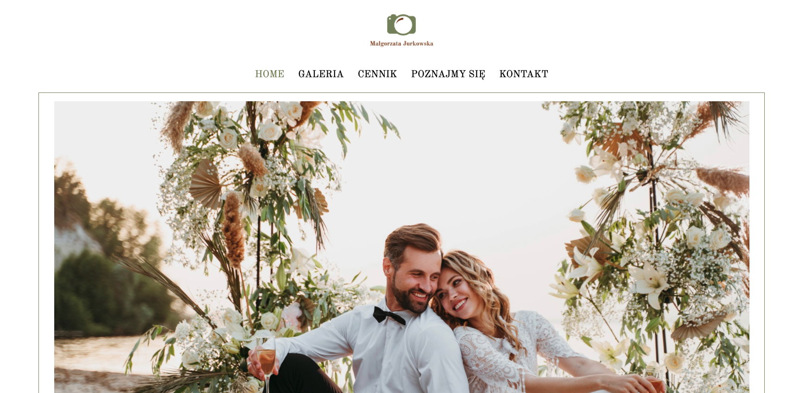
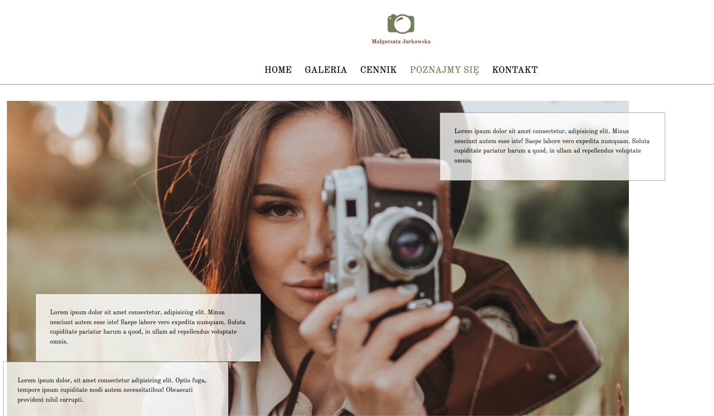
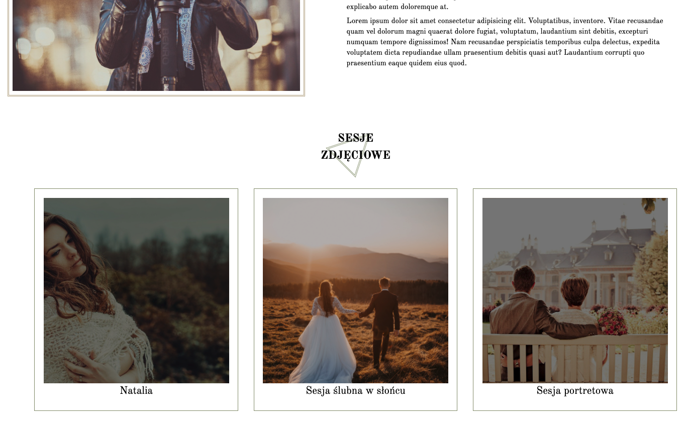
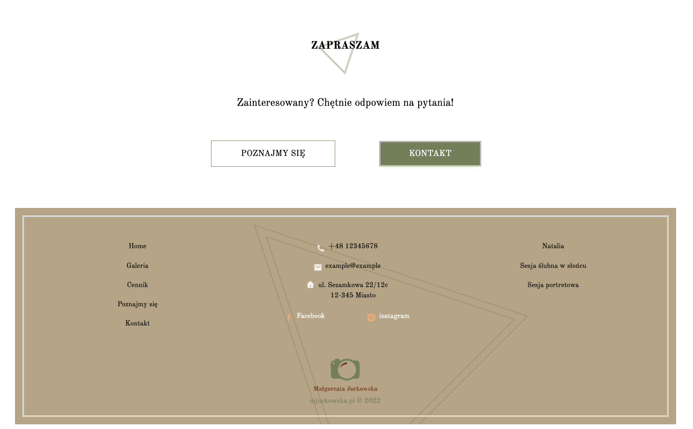
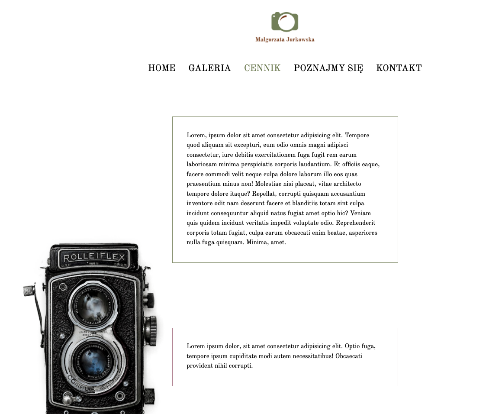
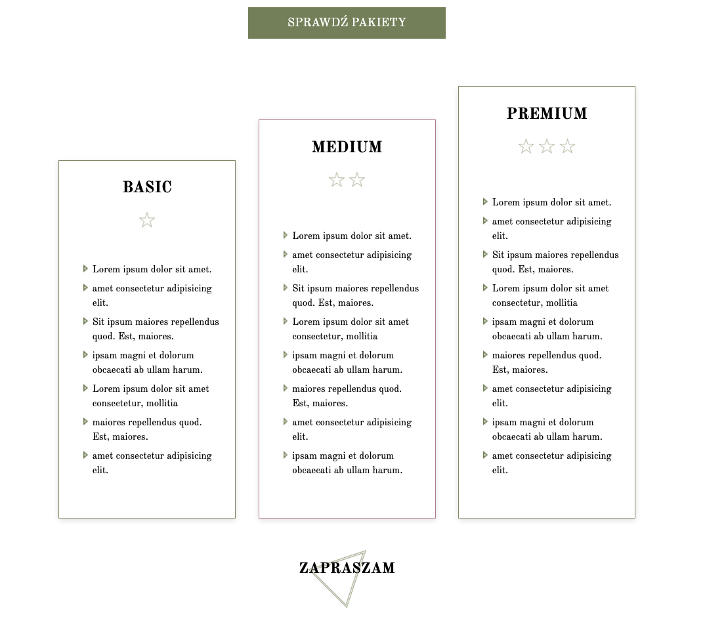

# MJurkowska

**MJurkowska** Website made for fictionall company. Fully responsive with an easy to manage SCSS structure.

just visit [https://gregsypek.github.io/MJurkowska](https://gregsypek.github.io/MJurkowska)!

### Features

- responsiwe web design
- slider components
- no external libraries

#### Under the hood

Technologies being used under the hood:

- HTML
- Vanillia JS
- CSS Variables

### License

MIT

---

Made with [@gregsypek](https://twitter.com/@gregsypek) 2022
